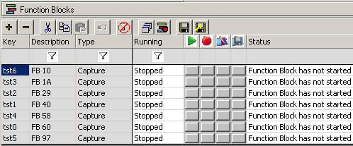
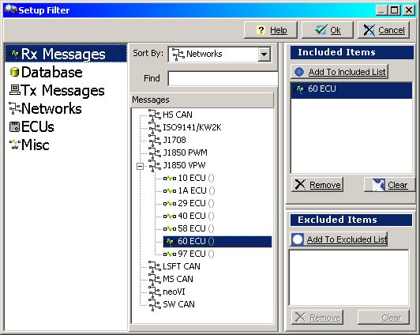

# Part 3 - Setup Capture Type Function Blocks

Capture type function blocks will be used to record the messages from the desired ECUs.

### 1. Create Capture Function Blocks:

Open the Function Blocks screen on the main menu bar by selecting "Scripting and Automation" and then  Function Blocks. Click the "+" button and select the desired function block type to add a function block. One function block per ECU is needed, so add seven Capture type () function blocks.

### 2. Rename the Function Blocks:

Vehicle Spy provides a default description for every function block added. To change the name of a function block, click on the text in the description column and type the new name. Rename the seven function blocks using ECU source IDs like the descriptions shown in Figure 1.

### 3. Setup Filters for the Capture Function Blocks:

Clicking on a function block will show its settings in the lower half of the window. Click the "Filters..." button in the Buffer tab to open the Setup Filter dialog (Figure 2). First, verify "Rx Messages" is the data source. Next, in the "J1850 VPW" tree branch, select the ECU (60 ECU). Finally, click the "Add to Included List " button and click "Ok" to close the dialog. The receive message that was added to the filter will now be used by Vehicle Spy to tell what messages need to be recorded.

### 4. Configure the Start and "Stop and Trigger" Settings:

On the Start tab leave the default setting to "Start Immediately". This means the function block will start when Vehicle Spy starts. On the "Stop and Trigger" tab select "Collect in a one-shot buffer" and set the buffer size to 10. This will collect 10 messages and save the data.

### 5. Storage Setup:

Click the Storage tab to display the Storage options. The first thing to change is the "Storage File" path. This is where the capture buffer file with the sorted ECU Data gets stored. Name the file "60EcuMsg.csv". Again the Source ID in the file name will help keep our data straight. Make sure that "Append Time and Date to file name" is unchecked. Also make sure that this function block is set to "Automatically save when complete".

### 6. Repeat for Each ECU:

The steps above need to be repeated for the 6 other ECUs we want to decode. Edit the remaining function blocks using the ECU source IDs (10, 1A, 29, 40, 58, and 97) to help identify each file and function block.\
\
&#xNAN;**\*Note:** Example file "Tutorial 4 - Part 1" can be loaded at this point if you got stuck somewhere in previous Tutorial 4 - Parts 1 to 3.
