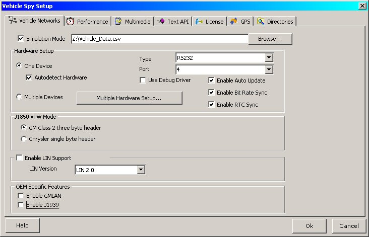

# Part 4 - Sort the ECU Messages

**\*Note:** Example file "Tutorial 4 - Part 1" can be loaded at this point if you got stuck somewhere in previous Tutorial 4 - Parts 1 to 3.

### 1. Simulate the Vehicle Hardware:

In this example we will be using a prerecorded data file to simulate our network traffic. The name of the file we will be using is [Vehicle Data.csv](https://cdn.intrepidcs.net/support/VehicleSpy/Vehicle%20Data.csv)" (click the link to download if necessary). To setup the simulation, click Tools --> Options on the main menu bar. Goto the "Vehicle Networks" tab and check the Simulation Mode box. Now open the "Vehicle Data.csv" file by clicking "Browse..." and opening the file. Click the Ok button to close the Vehicle Spy Setup dialog. The "Vehicle Networks" tab and its settings are shown in Figure 1.

### 2. Start Vehicle Spy:

From the main menu bar select Vehicle Networks --> Messages. Click the blue start button and messages will begin to scroll on the screen. If you go to Function Blocks, you can monitor the capture process and see when it is finished. Click stop when a sufficient number of messages have been collected. (NOTE: In the simulation file there is about a 1 minute delay before the buffer begins to repeat.) When you click stop, the separated ECU messages will be in your data folder.
