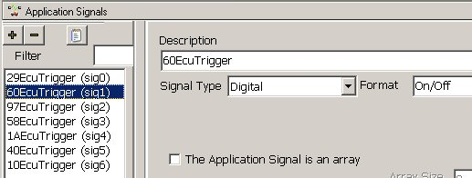

# Part 5 - Setup Application Signals

### 1. Setup Application Signals:

To keep things organized, save your work and start a new Vehicle Spy file. (If you do not wish to build a new file then a finished file can be opened from the Examples tab in the Logon screen called "Tutorial 4 - Part 2".)\
\
Open up the "Application Signals" view found under Scripting and Automation --> Application Signals. You can think of Application Signals as being like variables used in software programming. They can be set to different values or store different values for later use.\
\
For this tutorial we need seven Application Signals to help control Playback function blocks. Click the "+" to make a new Application Signal. Enter "60EcuTrigger" for the description. Change the Signal Type to "Digital" and set the Format to "On/Off".\
\
Repeat the previous steps for the other six ECU source IDs (10, 1A, 29, 40, 58, and 97) using the same naming convention.

