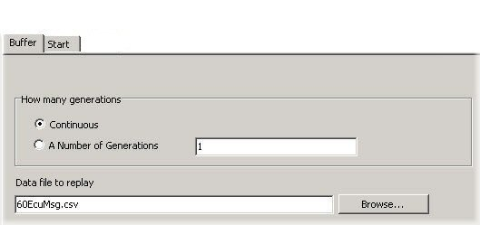

# Part 6 - Setup Playback Type Function Blocks

Two function blocks are needed for each ECU. One is for playing back the sorted file, the other is for turning the playback on and off. The first function blocks to set up are the Playback function blocks.

### 1. Create Playback Function Blocks:

Open the Function Blocks screen on the main menu bar by selecting "Scripting and Automation" and then  Function Blocks. One Playback block per ECU is needed, so use the "+" button to add seven Playback type () function blocks.

### 2. Rename the Function Blocks:

Similar to what you did before in Part 3, rename the seven Playback blocks using the ECU source IDs, something like "60EcuPlay" for example.

### 3. Pick a Playback File and How Many Generations to Replay:

Select the Playback function block for ECU ID 60. In the setup area in the lower half of the window click on the Buffer tab (Figure 1). For the "Data file to replay" use the Browse dialog to select the 60EcuMsg.csv file we created earlier in this tutorial. Select Continuous in the "How many generations" box to set the file to playback in a continuous loop.

### 4. Configure the Start Setting:

On the Start tab select "Manual Start". This allows the function block to be started using the Script type function blocks that will be set up in the next part of this tutorial.

### 5. Repeat for Each ECU:

Repeat the above steps for the other six ECUs. (10, 1A, 29, 40, 58, and 97)
