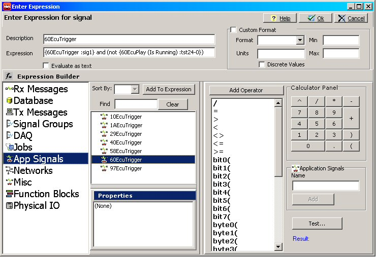
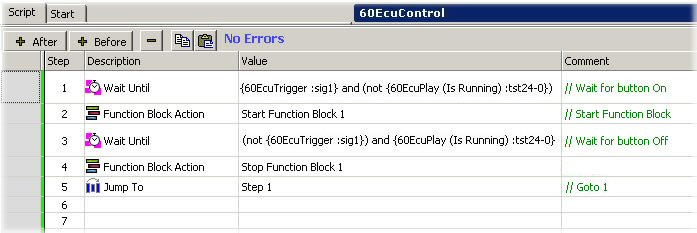

# Part 7 - Setup Script Type Function Blocks

In Part 5, Application Signals were built as triggers for the Playback function blocks. In Part 6, Playback function blocks were built to replay the sorted ECU files.\
\
In this part, Script function blocks will be built to control the Playback blocks using the Application Signals.

### 1. Create a Script Function Block:

Goto the Function Blocks screen. (If not already open, select the main menu bar "Scripting and Automation" then  Function Blocks.) Click the "+" button and add a Script type () function block.

### 2. Rename the Function Block:

Similar to what you did before in Parts 3 & 6, rename the Script block using the ECU source ID, something like "60EcuControl" for example.

### What is a Function Block Script?:

A function block Script is a list of commands for Vehicle Spy to follow. The script is entered as a sequence of steps in the Script tab of the function block setup. Script steps are edited by double clicking on the Description, Value, or Comment cell and selecting what you want it to do.

* The Description cell has a pulldown list of commands to choose from. (Ex: Wait For)&#x20;
* The Value cell adjusts itself to the command that was chosen and is used to setup the command details. (Ex: 1 sec)&#x20;
* Comments are simply short notes to help describe what is being done. (Ex: "This step is waiting for 1 second.")

### 3. Write the Script:

What this script is going to do is check the state of the trigger input and the state of the Playback block and activate the Playback block accordingly. Figure 2 shows what the finished script should look like. Here is some information for each step in the script:\
\
**Step 1** - We initially want to wait until the trigger condition is met. Double click the Description cell and select "Wait Until" for the first command. Now double click the Value cell to bring up the Expression Builder for the "Wait Until" command.\
\
From the left-hand side select "App Signals" then double click on the "60EcuTrigger" application signal. Notice the signal gets added to the Expression field located near the top of the screen. From the operator selection list (middle-right area) double click "and". Click "(" on the Calculator Panel then double click "not" from the operator list.\
\
Back on the left-hand side change the data source to Function Blocks. Highlight the function block "60EcuPlay". Verify the "Is Running" property is selected at the bottom then double click "60EcuPlay". Add a closing ")" and the equation should be complete!\
\
The Expression field should now look something like **{60EcuTrigger :sig1} and (not {60EcuPlay (Is Running) :tst24-0})**. This logic statement says, in English, wait until the ECU Trigger is on and the Playback function is not running before proceeding. Figure 1 shows the Expression Builder with the finished equation.

**Step 2** - After Step 1 is true we want this script to start the Playback function block. Select the "Function Block Action" command. Select "Start" and "60EcuPlay" after double clicking on the value cell.\
\
**Step 3** - Similar to Step 1, select "Wait Until" and enter the following equation using the Expression Builder: **(not {60EcuTrigger :sig1}) and {60EcuPlay (Is Running) :tst24-0}**. Your equation may be slightly different, but if you select everything from the Expression Builder it will work. This logic statement is saying to wait until the ECU Trigger is Off and the Playback function is On until proceeding.\
\
**Step 4** - Similar to Step 2, we want to stop the Playback block after Step 3 is true. Select the "Function Block Action" command. Select "Stop" and "60EcuPlay" after double clicking on the value cell.\
\
**Step 5** - Select the "Jump To" command and set its value to "Step 1". Do not worry if you have extra steps because they will not be called due to this "Jump To" command.

### 4. Configure the Start Setting:

On the Start tab select "Manual Start". This allows the Script function block to be started using Graphical Panel controls that will be set up in the next part of this tutorial.

### 5. Repeat for Each ECU:

Create more Script function blocks for the remaining ECUs (10, 1A, 29, 40, 58, and 97) by repeating the above steps. Make sure to use the correct application signal triggers and Playback function blocks.
