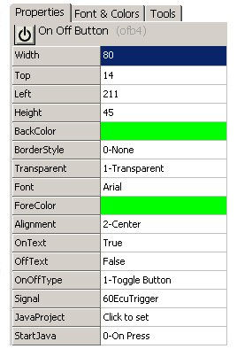
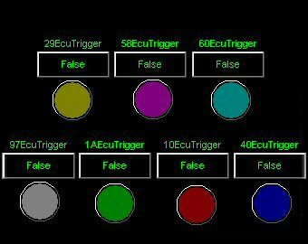

# Part 8 - Construct a User Dialog

Let's tie the Application Signal triggers from Part 5 to some user controls on a Graphical Panel.

### 1. Add On/Off Button Controls:

Open the Graphical Panels view using the main menu bar Measurement --> Graphical Panels. All available control and display tools are shown along the bottom of the window. Click the On/Off Button tool to select it, then click on the empty Graphical Panels window to add it to the screen. Set the following On/Off Button properties:

<table><thead><tr><th width="205">Property</th><th>Setting</th></tr></thead><tbody><tr><td>OnText</td><td>True</td></tr><tr><td>OffText</td><td>False</td></tr><tr><td>OnOffType</td><td>1-Toggle Button</td></tr><tr><td>Signal</td><td>60ECUTrigger</td></tr></tbody></table>

Feel free to play with the other properties to see what they do. Figure 1 shows one possible way of setting the other properties.

Make more On/Off Buttons for the six remaining ECUs: 10, 1A, 29, 40, 58, and 97.

### 2. Add Status Lights:

Select the LED tool and click on an empty spot on the Graphical Panel. Select "60EcuTrigger" for the Signal. Also use the LedColor property to pick a color for the indicator light. Again, repeat for the other 6 ECUs. An example of a possible layout can be seen in Figure 2.

