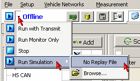

# Part 9 - Run the Setup

Now it is time to see all of the parts of this tutorial working together. (Example file "Tutorial 4 - Part 2" can be opened at this point if you got stuck somewhere previously.)

### 1. Start Simulation Mode With No Replay File:

To better see the results of this tutorial, simulation mode will be used, but without a replay file. Click on the dropdown arrow next to the Start button. Select "Run Simulation", then "No Replay File" (Figure 1). Using this type of simulation, the only messages that will be seen are the ones from the Playback CSV files.

### 2. Use the Setup:

Experiment with window docking to arrange these 4 windows to your liking:

* Messages
* Graphical Panels (Can toggle edit mode using lock/unlock button in lower right corner.)
* Function Blocks
* Application Signals

On the graphical panel click on one of the trigger buttons. Notice on the Messages view in scroll mode that the messages captured in the CSV file for that ECU are being transmitted on to the bus. You can not hurt anything while running in simulation mode, so now is the time to experiment and enjoy this setup.

### You're Done!

Congratulations. You have completed the setup of sorting messages by ECU source ID and selectively playing them back on the bus. We covered all of the following topics:

* Creating Function Blocks of different types. (Capture, Playback, & Script)
* Creating a Graphical Panel.
* Using Application Signals.
* Making filters for sorting data by ECU source ID.
