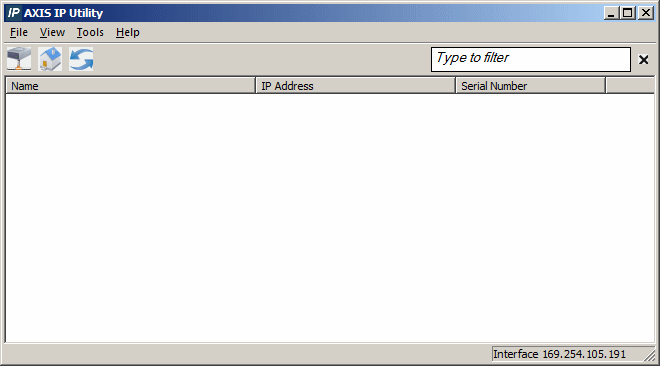
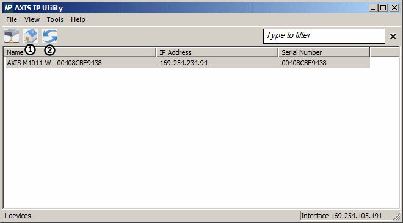
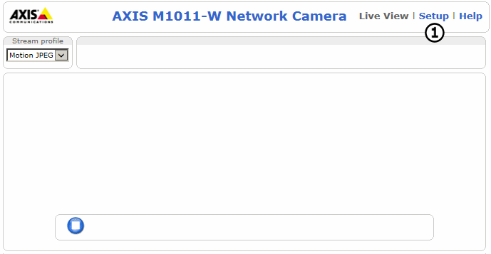
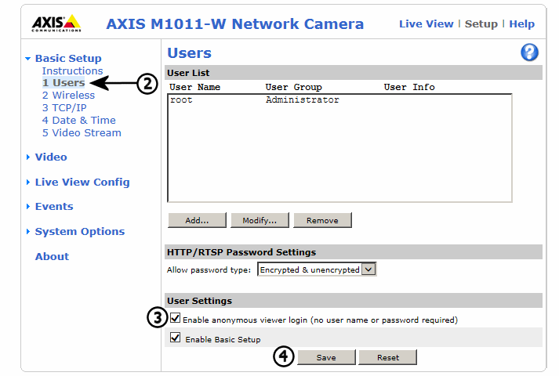
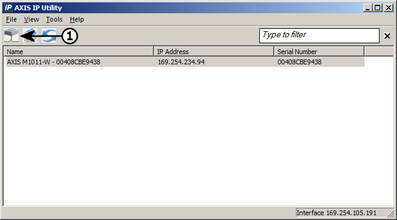
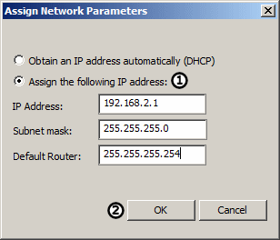

# Tutorial: Standalone Video Logging - Part 1 - Setting up the Axis Camera

### 1. Open the AXIS IP Utility:

Navigate to the AXIS IP Utility that was downloaded and double click it to launch. The main Axis IP Utility window should now be open (See Figure 1).

### 2. Select the Camera and Enable Anonymous Login:

Select the camera that needs setup by clicking on it, then open up the web portal for the camera by clicking on the 'House' icon (Figure 2 ). If the camera does not show up, push the refresh button(Figure 2 ).

Once the webpage has opened, select 'Setup' in the top right corner of the screen (Figure 3 ). If credentials are requested, enter 'root' as the user name and the password for the camera under 'password'. Once logged into the Axis dashboard click on 'Users' (Figure 3 ). Finally, check the box next to 'Allow Anonymous Login' (Figure 3 ) and click 'Save' (Figure 3 ) at the bottom of the screen. Wait for the page to reload before closing out of the window.

### 3. Set the Camera IP Address:

The AXIS IP Utility will be up after closing the web portal. Make sure that the same camera is selected, then click the networking button (Figure 4 ).

In the 'Assign Network Parameters' window that pops up, click on 'Assign the following IP Address' (Figure 5 ), then fill in the form with the following:\
\
**IP Address:** 192.168.2.X - The 'X' can be any number from 1 to 8 depending on how many cameras are being used.\
**Subnet Mask:** 255.255.255.0\
**Default Router:** 255.255.255.254

Finally, click OK (Figure 5 ). This will save the changes made to the camera making it ready for video logging.\
\
If more than one camera is being set up, repeat the steps above for each camera. When this is complete, move onto the next part of the tutorial.
