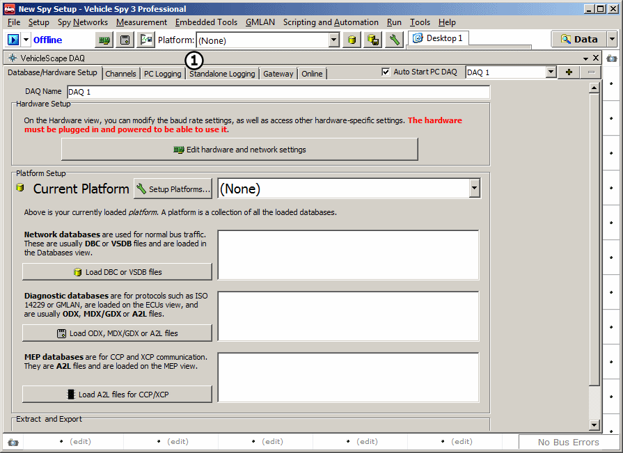
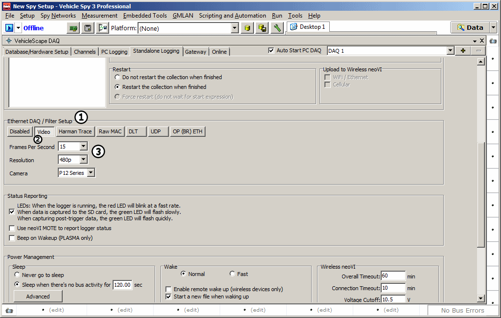
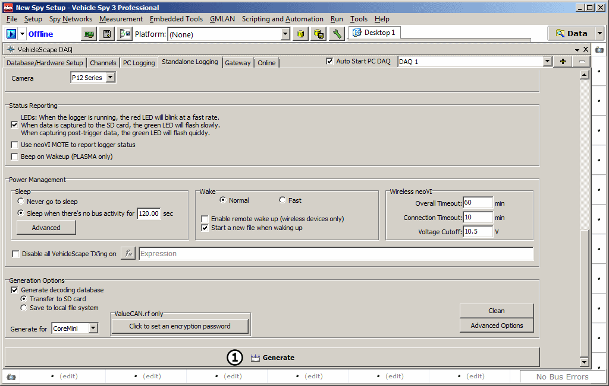
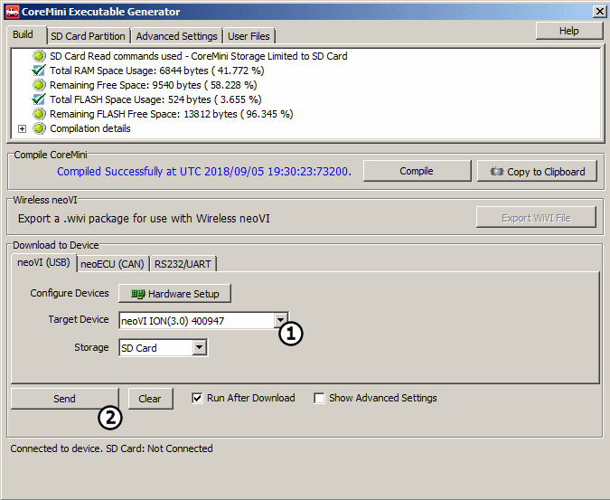

# Tutorial: Standalone Video Logging - Part 2 - Setting Up Vehiclescape DAQ

### 1. Open up Vehiclescape DAQ:

Open up Vehicle Spy, then open 'Measurement' -> 'Vehiclescape DAQ' and select the 'Standalone Logging' tab (Figure 1 ).

### 2. Enable and Setup Ethernet DAQ\Filter:

Look for Ethernet DAQ\Filter (Figure 2 ) about halfway down the Vehiclescape DAQ page. Under Ethernet DAQ\Filter, make sure the 'Video' button (Figure 2 ) is selected. After that, adjust the 3 video settings (Figure 2 ) to whatever suits the particular needs of the project at hand. Remember that higher resolution and higher frame rate will take up more space on the SD card during logging.

### 3. Set up the rest of Vehiclescape DAQ:

Set up the rest of the 'Standalone Logging' settings to the needs of the project. For information on this see the [Standalone Logging Tutorial](../tutorial-simple-standalone-logging/).

### 4. Send the Standalone Logging script to your device:

Scroll to the bottom of the 'Standalone Logging' tab and find 'Generate'. Click on 'Generate' (Figure 3 ) to open the CoreMini window.

In the CoreMini window, make sure the correct hardware is selected (Figure 4 ), then push the 'Send' (Figure 4 ) button near the bottom of the page. Once this is completed, close the CoreMini window. The neoVI device is now ready to start logging video.

