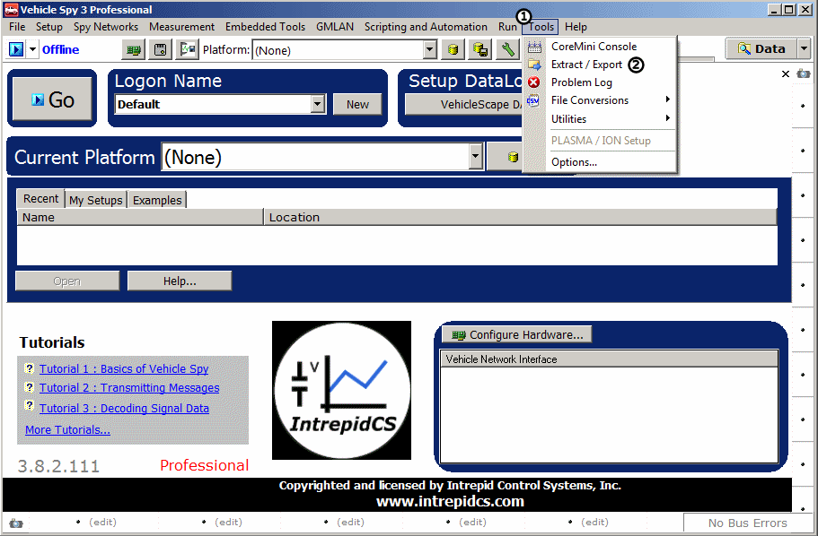
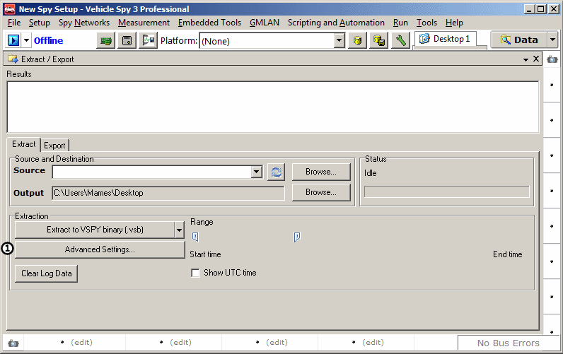
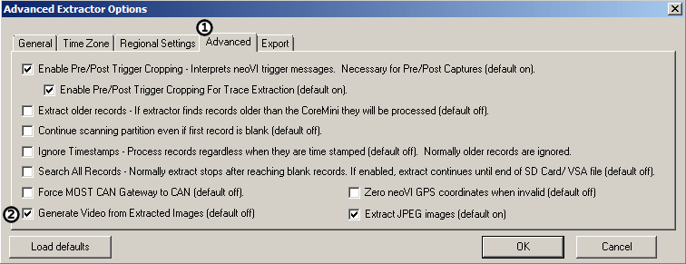
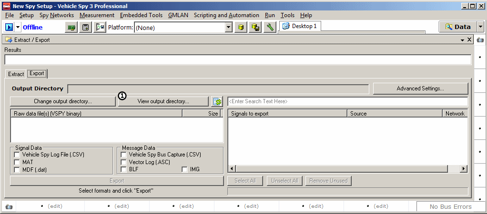
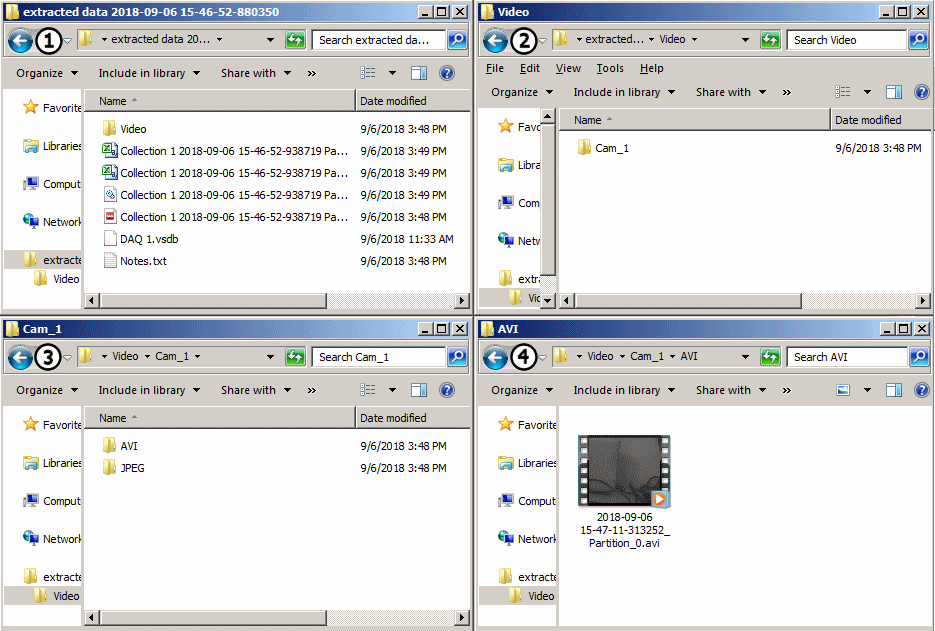

# Tutorial: Standalone Video Logging - Part 3 - Extracting the Video

### 1. Open the Extract/Export Tool

The Extract/Export tool can be opened by clicking on Tools (Figure 1) -> Extract/Export (Figure 1).

### 2. Set Up 'Extract' Settings

Under the Extract tab, click the 'Advanced Settings' button (Figure 2 ).

In the 'Advanced Settings' window, click on the 'Advanced' tab (Figure 3 ), then make sure that the 'Generate Video from Extracted Images' box (Figure 3 ) is checked. Push 'OK' when finished.

### 3. Extract and export data

Extract and export the data according to the needs of the project. For information on how to do this, refer to the [Standalone Logging tutorial](../tutorial-simple-standalone-logging/). Finally, click on 'View Output Directory' (Figure 4 ) and open the folder containing the extracted data.

In the Extracted Data folder, click on Video, then on Cam\_X (X will be the number you assigned to 192.168.2.X), then on AVI. This is the final video from the logged video. From here, the video can be edited, saved, or whatever is required for the project.

