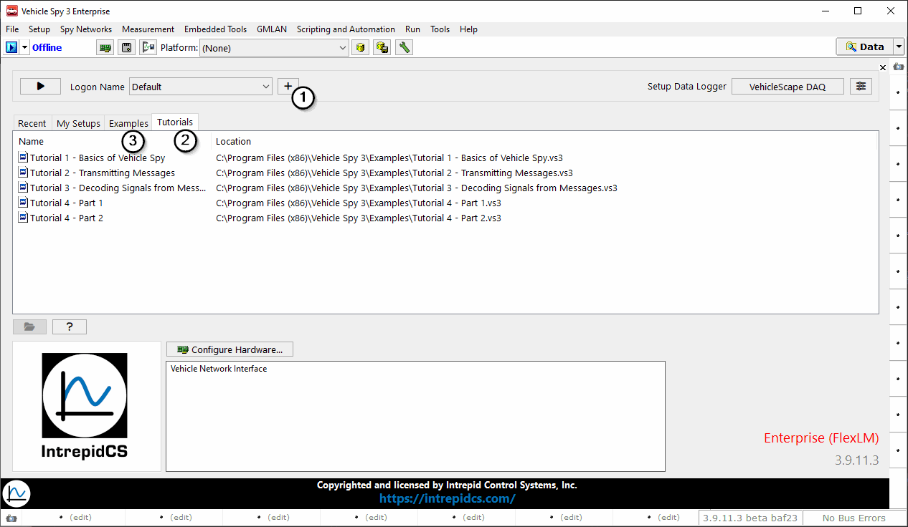

# Part 1 - Load the Setup File

In this tutorial, how to transmit messages on an in-vehicle network using Vehicle Spy will be shown.

### 1. Return to the Vehicle Spy Logon Screen:

This can be done in two different ways. First, if you already have Vehicle Spy open, make sure that it is stopped, and then click on **File> Logon** from the dropdown. If Vehicle Spy is not open, double click the icon on your desktop and it will automatically open to the Logon screen. Choose a logon name (Figure 1:).

### 2. Load Tutorial 2:

Select **Tutorial 2 - Transmitting Messages** from the **Tutorials** (Figure 1:) menu in the lower left corner to open tutorial and launch Help. Tutorials can also be accessed from the **Examples** tab (Figure 1:).

