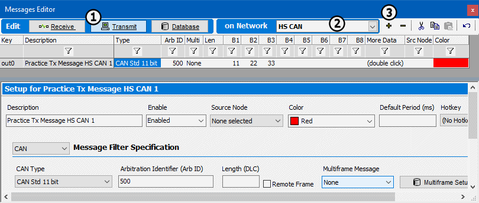

# Part 2 - Enter a Transmit Message

In Tutorial 1, it was shown how to set up a receive message specification in the Messages Editor view. Returning to this view, a message will be set up to be transmitted by Vehicle Spy.

### 1. Open the Messages Editor Panel:

Using the custom tab set at the top of the main workspace, open the **Messages Editor** view. This view can also be opened by selecting **Spy Networks > Messages Editor**.

### 2. Switch to the Transmit Messages Table:

Select the **Transmit** button (Figure 1: ) along the top of the Message Editor panel . This switches to the Transmit message setup. Next, select **HS CAN** from the **on Network** dropdown (Figure 1:). Click the **+ button** (Figure 1:) to add a new message.

### 3. Define Transmit Message:

After adding a new message, a setup dialog appears below. In this dialog transmit message specifications such as description, Arb ID, and color are entered. Create a message called **Practice TX Message** for **HS CAN**. Give it an Arb ID of **500** and data bytes **11-22-33**. Enter the data bytes starting in column **B1** in the spreadsheet, as shown in **Figure 1**.

### 4. Examine Completed Message:

Notice how all of the information added in the Setup dialog was automatically added to the spreadsheet view just above.
