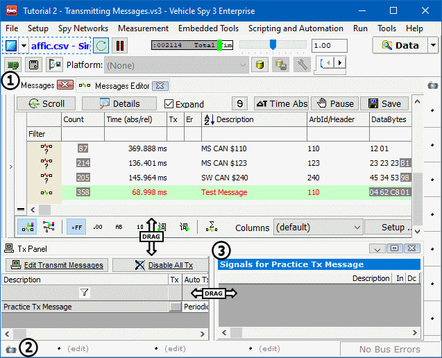

# Part 3 - Utilize the Alternate Workspace Panels

Back in the Vehicle Spy User Interface Introduction, Alternate Workspace panels were introduced docked at the bottom and the right of the user interface. In this exercise these panels will be used to view both the Tx Panel and Messages view simultaneously.

### 1. Open Messages View:

From the main menu select **Spy Networks > Messages** (Figure 1:). The Messages view will fill the main workspace.

### 2. Set the Bottom Alternate Workspace Panel:

Click on the **View** icon (Figure 1:) at the lower left of the user interface. Select **Spy Networks > Transmit Panel**. The Tx Panel opens in the alternate workspace at the bottom of the user interface while Messages view stays in place.\
\
To resize the alternate workspace, click on the area between the two panes and drag the window to the desired size (Figure 1:).

Right now this feature might not seem that important. However, in the next part of this tutorial it will be very handy.

Please check the following video for more details.



