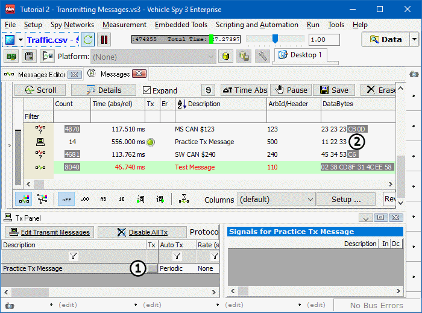

# Part 4 - Manually Transmit a Message

Now that the Messages view and Tx Panel views are both open, take a close look at the Tx Panel. Practice Tx Message is already there! Now for a closer look at how the Tx Panel works.

### 1. Start Vehicle Spy:

Make sure you see data flowing in Messages view. If not, press the **Play** button.

### 2. Click on the Manual Tx Button:

To the right of Practice Tx Message description in the Tx Panel is a gray **Tx box** (Figure 1:). Clicking this box transmits the message. Go ahead and give it a few clicks.\
\
In static mode in the Messages view Practice Tx Message should now appear in the list of messages (Figure 1:). The message count will initially be highlighted to signify recent activity. If the message is not transmitted again soon, its highlighting will fade away.\
\
In scrolling mode, Practice Tx Message might not have been visible. By the time the Tx button was clicked, the message had already gone flying by. To view the message in scrolling mode, click the **Pause** button and scroll back through the messages until it is found, or just click the Tx button again while paying closer attention. It should be easily spotted as it goes by. All Tx Messages have a green LED symbol in the Tx column. This signifies that the message is a transmit message.

