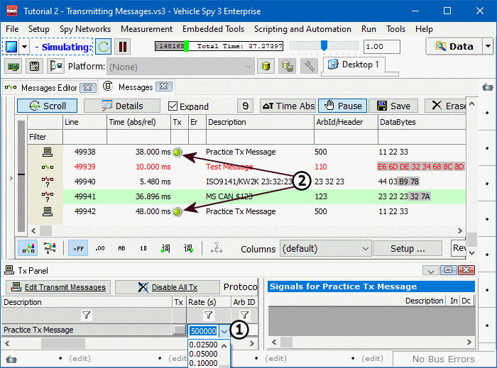

# Part 5 - Periodically Transmit a Message

Often a message must be transmitted regularly. Rather than sit around clicking the Tx button all day, Vehicle Spy enables users to specify when and how often a message will be transmitted.

### 1. Set Auto Tx and Rate:

Look at the Tx Panel again and notice the Auto Tx and Rate columns. Previously these were left alone, but now these will be set up. Changing the **Auto Tx** column will change how the message is sent out. For this example leave it set to **Periodic**. Next, double click in the space directly to the right in the **Rate** column (Figure 1:). A dropdown arrow appears, that when clicked, shows a list of common values. If a specific value is needed and not found in the dropdown, it can typed into the field directly. For this tutorial, select **0.1** seconds from the dropdown. Vehicle Spy has been told to transmit the Practice TX Message periodically every 0.1 seconds.

### 2. Check Message Traffic:

After this is set up, look back at Messages view. If you are in scrolling mode, a steady stream of Practice Tx message should be seen flying by (Figure 1:). In static mode, Practice Tx Message should be highlighted and its message counter should be increasing rapidly.

