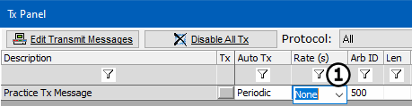
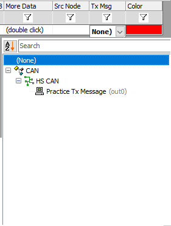
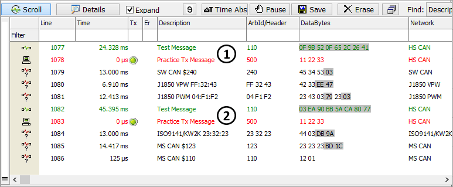

# Part 6 - Automatically Respond to a Message

In addition to manual and periodic transmission, Vehicle Spy is also capable of automatically responding to a message.

### 1. Set Tx Message Back to Manual Mode:

To remove the 0.1 periodic transmission mode, simply set the **Rate** column back to **None** (Figure 1: ) for Practice Tx Message.

### 2. Open Messages Editor Receive Table:

Open the Messages Editor using the tabs for your main workspace. Notice that a message called **Test Message** has already been set up in the Receive table for use in this exercise.

### 3. Setup an Auto Response:

Using the spreadsheet view, double click on the **Tx Msg** column for the Test Message (Figure 2). A dropdown of defined Tx messages opens. In this case, just Practice Tx Message is present but if more transmit messages were defined, they would also appear here. Select **Practice Tx Message** and press **Enter**. Vehicle Spy has been told to automatically send Practice Tx Message every time it receives Test Message.

### 4. Examine Message Traffic:

Switching back to Messages view, observe that for every occurrence of Test Message, Vehicle Spy responds with a transmission of Practice TX Message. (This will be easier to view in scroll mode, but you may have to press **Pause**.) The Messages view should look similar to the one below (Figure 3: , ).

**Extra Credit:** For extra practice, set up a custom filter to include both Test Message and Practice TX Message. Try doing this by using column filters.
