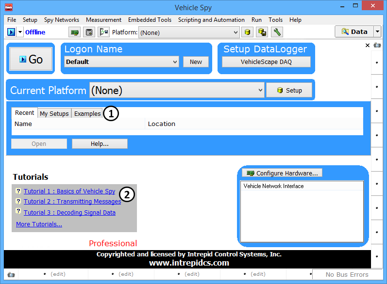

# Vehicle Spy Tutorial Files

You can quickly access the [tutorials](./) included with Vehicle Spy by selecting them from the **Examples** tab (Figure 1:) or the **Tutorials** tab (Figure 1:) on the Vehicle Spy [Logon screen](../basic-operation-of-vehicle-spy/the-logon-screen.md).

